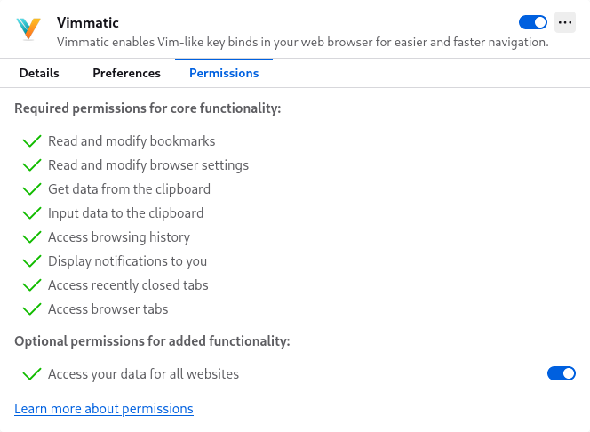

# Troubleshooting

## The addon is not working on the Firefox

The firefox addon with Manifest V3 requires optional permissions to work well
on any website. You can find it on `Permissions` section of `Vimmatic` settings
on the `about:addons` page.  Please make sure that the `Access your data for
all websites` is enabled.



## Url tooltip is hiding the console

When them mouse cursor hovers over a link, a tooltip shows up in the bottom of
the screen.  It can hide the console of the addon.  You can remove this tooltip
by adding custom styles into `userChrome.css` file.  Please follow the steps
below:

1. Enable the `toolkit.legacyUserProfileCustomizations.stylesheets` option in
   the `about:config` page.
2. Create `userChrome.css` file in the `chrome` directory under the profile
   directory.  The location of the `userChrome.css` should be `<profile
   directory>/chrome/userChrome.css`.  You can find the location of the profile
   directory at the `Profile Directory` section on the `about:support` page.
3. Add the following content into the `userChrome.css` file:

   ```css
   @namespace url("http://www.mozilla.org/keymaster/gatekeeper/there.is.only.xul");
   
   #statuspanel {
     display: none !important;
   }
   ```

4. Restart the browser.
